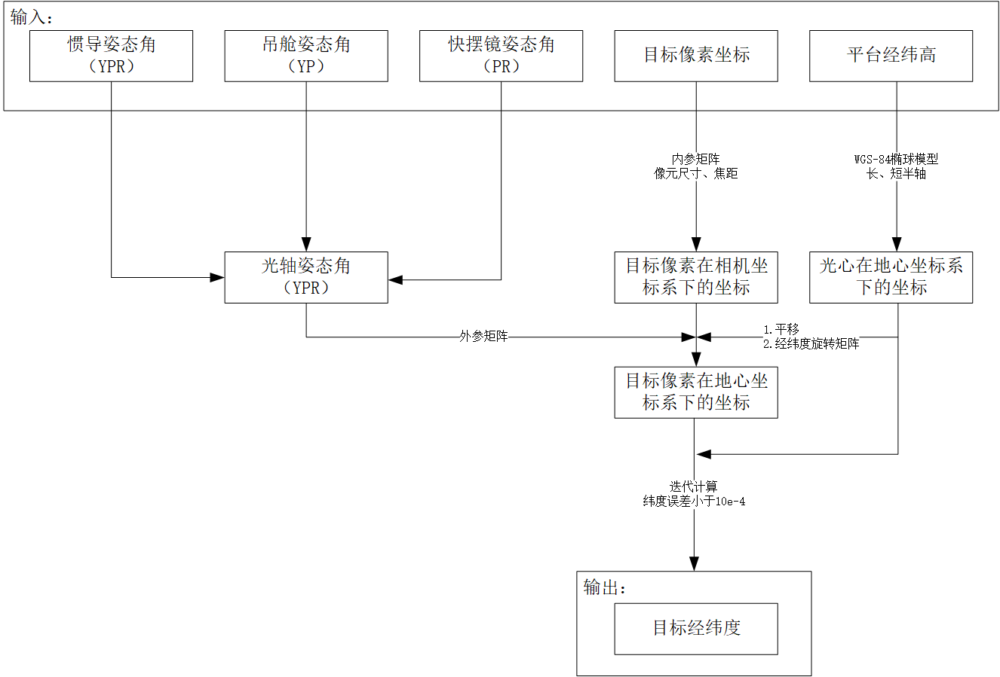
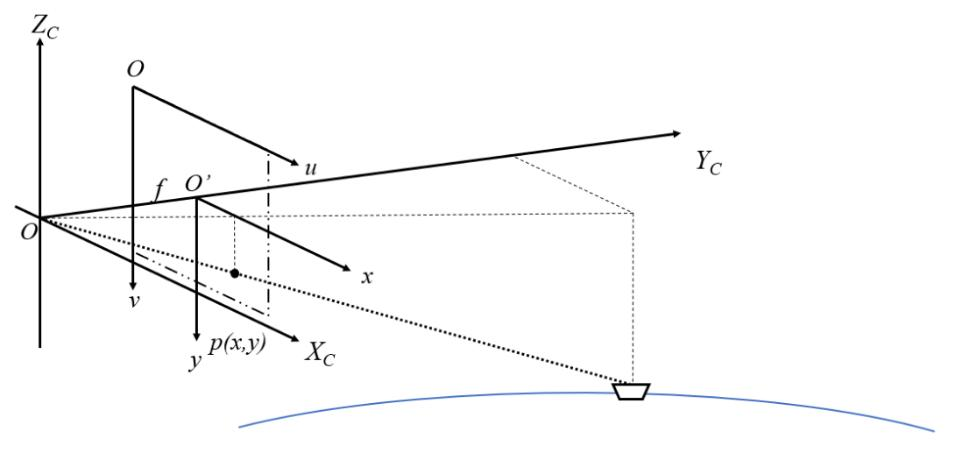
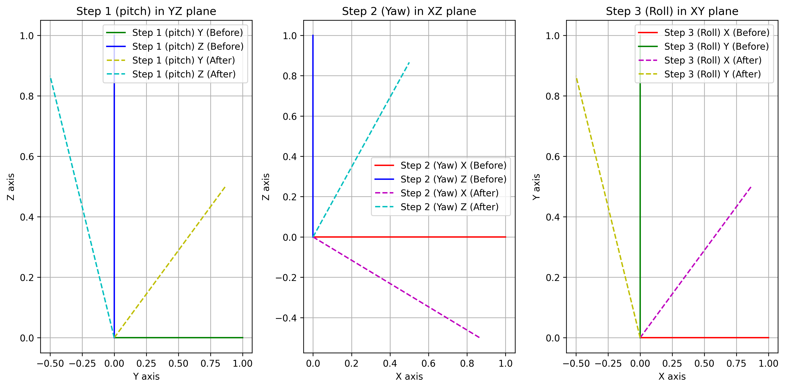
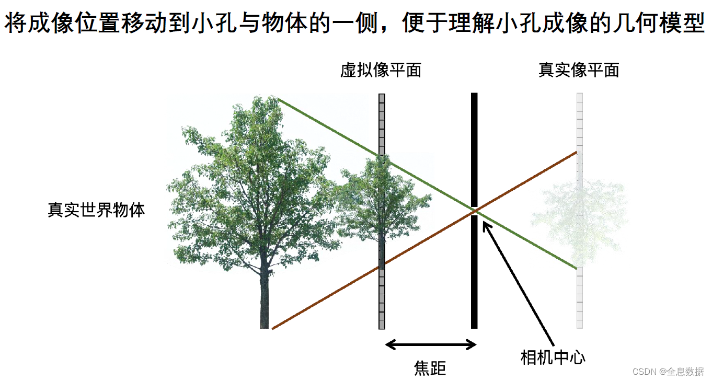
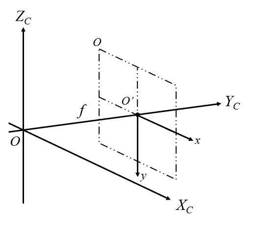
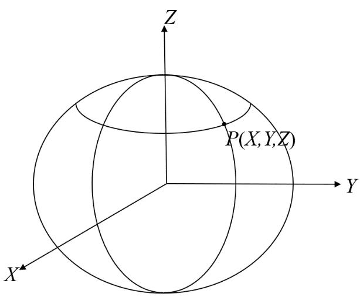

# 目标定位算法



- 第一步: 由目标像素坐标，结合相机焦距、像元尺寸和传感器像素数，计算目标像素在相机坐标系下坐标；

- 第二步: 由第一步求得的目标像素在相机坐标系下坐标，结合定位平台、相机姿态角求得的光轴姿态角以及定位平台经纬度，得到目标像素在地心坐标系下坐标； 

- 第三步: 将第二步求得的目标在地心坐标系下坐标，结合由定位平台经纬高转换到的光心在地心坐标系下的坐标，计算这两点确定的直线与地球椭球模型在地心坐标系下的交点，交点即为目标在地心坐标系下的坐标; 

- 第四步: 将第三步求得的目标在地心坐标系下坐标转换为目标经纬度。 



## A. 坐标系定义

1. 惯导坐标系（东北天，ENU坐标系）

    X轴（E）： 指向正东
    Y轴（N）： 指向正北
    Z轴（U）： 指向正上方（天顶方向）

2. 载体坐标系（机体坐标系）

    初始状态时与ENU重合。

    Y轴（$Y_B$）： 指向机体前进方向（机头朝向）
    X轴（$X_B$）： 指向机体右侧
    Z轴（$Z_B$）： 满足右手坐标系，指向机体上方

3. 吊舱坐标系

    与光电吊舱绑定，吊舱的姿态角是相对于载体坐标系测量的。

    Y轴（$Y_C$）： 当吊舱的航向角（ψ<sub>c</sub>）和俯仰角（θ<sub>c</sub>）为0时，Y轴与载体坐标系的Y轴方向重合。
    X轴（$X_C$）： 与载体坐标系的X轴一致（右侧）
    Z轴（$Z_C$）： 满足右手坐标系，指向吊舱下方

4. 快摆镜

    假设与光电吊舱绑定，快摆镜的姿态角（俯仰、横滚）是相对于载体坐标系测量的。（**需要实验验证**）

***

## B. 旋转矩阵定义

1. 绕 X 轴的旋转矩阵：
$$
R_x(\theta) = \begin{bmatrix}
1 & 0 & 0 \\
0 & \cos(\theta) & \sin(\theta) \\
0 & -\sin(\theta) & \cos(\theta)
\end{bmatrix}
$$

2. 绕 Y 轴的旋转矩阵：
$$
R_y(\phi) = \begin{bmatrix}
\cos(\phi) & 0 & -\sin(\phi) \\
0 & 1 & 0 \\
\sin(\phi) & 0 & \cos(\phi)
\end{bmatrix}
$$

3. 绕 Z 轴的旋转矩阵：
$$
R_z(\psi) = \begin{bmatrix}
\cos(\psi) & -\sin(\psi) & 0 \\
\sin(\psi) & \cos(\psi) & 0 \\
0 & 0 & 1
\end{bmatrix}
$$

根据右手定则，可视化对每一轴的旋转结果如下：



- step1: 绕x轴旋转30度, 在y-z平面的变化 (抬头为正);

- step2: 绕y轴旋转30度, 在x-z平面的变化 (右偏转为正);

- step3: 绕z轴旋转30度, 在x-y平面的变化 (逆时针旋转, 北偏东为正);

## C. 计算步骤

1. 相机坐标计算

    要计算目标相机坐标系下坐标，首先由传感器像元尺寸、 传感器像素数将目标像素坐标系下坐标转换到图像物理坐标系下坐标，再结合相机焦距转换到相机坐标系下坐标。

    计算公式如下：

    由图像像素坐标p(u,v)计算像素在坐标系下的坐标P(Xc, Yc, Zc)

    $$
    \begin{bmatrix}
    X_c \\
    Y_c \\
    Z_c
    \end{bmatrix}
    = d \cdot K^{-1} \cdot
    \begin{bmatrix}
    u \\
    v \\
    1
    \end{bmatrix}
    $$

    其中 \(K\) 为相机[内参矩阵](https://www.cnblogs.com/ymzcch12/p/18244362)，形式为：

    $$
    K = \begin{bmatrix}
    f_x & 0   & c_x \\
    0   & f_y & c_y \\
    0   & 0   & 1
    \end{bmatrix}
    $$

    - \(f_x\) 和 \(f_y\) 是相机在 \(x\) 和 \(y\) 方向上的焦距，表示将物理坐标上的焦距映射进缩放。

        \[
        f_x = \frac{f_c}{d_x}, \quad f_y = \frac{f_c}{d_y}
        \]

        \(f_c\) 表示相机焦距。 \((d_x, d_y)\) 表示像素尺寸。

    - \(c_x\) 和 \(c_y\) 是主点坐标（近似为 \(width/2\) 和 \(height/2\)）。
    - d 是从摄像机到物体表面之间的距离。考虑处理的是正交投影、无透视变换情况，设d=1。

        
        

    具体地计算中采用了简化模型([参考](https://blog.csdn.net/qq_23022733/article/details/131340135]))，不考虑物体的深度信息，假设物体各个部分都在一个平面内。

    建立了相机坐标系如上图。相机坐标系是三维坐标系，由图像物理坐标系扩展而来。以相机光心为原点建立相机坐标系，XC轴与图像物理坐标系的 x 轴平行，YC轴为相机光轴， ZC轴与图像物理坐标系的 y 轴平行。

    具体计算过程如下：
        ①. 由像素坐标通过像元尺寸、传感器像素数计算得到像素物理坐标`P（x,y）`；
        ②. 再由相机焦距 f表示为相机坐标系下的坐标`P（x,f,y）`。
        

2. 光轴姿态角计算

    相机相对定位平台在航向、 俯仰方向的姿态，与惯性导航采集定位平台相对于大地坐标系在航向、 俯仰和滚动方向的姿态，共同决定了光轴相对于大地的姿态角。即吊舱采集的姿态角和惯导采集的姿态角共同决定了光轴姿态角。
    
    要计算光轴姿态角，首先通过相机姿态角、定位平台姿态角求光轴姿态矩阵，再将姿态矩阵分解出光轴姿态角。

    具体地，按照以下五个步骤建立[旋转矩阵](https://blog.csdn.net/mao834099514/article/details/125083320)：

    绕X<sub>C</sub>轴旋转相机俯仰角 $\theta'$
    绕Z<sub>C</sub>轴旋转相机航向角 $\psi'$
    绕Y<sub>C</sub>轴旋转定位平台滚动角 $\phi$
    绕X<sub>C</sub>轴旋转定位平台俯仰角 $\theta$
    绕Z<sub>C</sub>轴旋转定位平台航向角 $\psi$

    所有旋转均为**逆时针**，旋转矩阵的乘积顺序为从**右到左**，按照“**偏航-俯仰-横滚**”的[顺序旋转](https://glooow1024.github.io/2024/04/16/rotation/)，即旋转矩阵：

    $$R_{A} = R_{X_C}(\theta') \cdot R_{Z_C}(\psi') \cdot R_{Y_C}(\phi) \cdot R_{X_C}(\theta) \cdot R_{Z_C}(\psi)$$

    设旋转矩阵为 \( R_A \)，可以表示为：

    \[
    R_A = \begin{bmatrix}
    a_{00} & a_{01} & a_{02} \\
    a_{10} & a_{11} & a_{12} \\
    a_{20} & a_{21} & a_{22}
    \end{bmatrix}
    \]

    \( R_A \) 是一个 \( 3 \times 3 \) 的矩阵，通过矩阵 \( R_A \)，可以得到光轴航向角 \( \alpha \)、光轴俯仰角 \( \beta \)、光轴横滚角 \( \gamma \)，计算方法如公式所示：

    \[
    R_{\text{final}} = 
    \begin{bmatrix}
    \cos(\gamma)\cos(\alpha) + \sin(\gamma)\sin(\beta)\sin(\alpha) & -\cos(\gamma)\sin(\alpha) + \sin(\gamma)\sin(\beta)\cos(\alpha) & -\sin(\gamma)\cos(\beta) \\
    \sin(\alpha)\cos(\beta) & \cos(\alpha)\cos(\beta) & \sin(\beta) \\
    \sin(\gamma)\cos(\alpha) - \cos(\gamma)\sin(\beta)\sin(\alpha) & \cos(\alpha)\cos(\beta) - \sin(\gamma)\sin(\alpha) - \cos(\gamma)\sin(\beta)\cos(\alpha) & \cos(\gamma)\cos(\beta)
    \end{bmatrix}
    \]

    \[
    \alpha = \arctan\left(\frac{a_{10}}{a_{11}}\right)
    \]
    \[
    \beta = \arcsin(a_{12})
    \]
    \[
    \gamma = -\arcsin\left(\frac{a_{02}}{a_{22}}\right)
    \]

    ```python
    alpha = np.arctan2(R_final[1, 0], R_final[1, 1])  # yaw
    beta = np.arcsin(R_final[1, 2])  # pitch
    gamma = -np.arctan(R_final[0, 2] / R_final[2, 2])  # roll
    ```
    
    注意：
    1. arctan2与arctan的区别，arctan的值域范围是[-90,90]，可以满足横滚角范围。但是，偏航角范围为`0~360`或者`-180~+180`，arctan无法区分象限。因此，使用arctan2。
    2. 三角函数计算为弧度，计算结果也为弧度。函数输入、输出需要弧度-角度的转换。
    
    为了证明计算过程的准确性，选择一组已知的旋转角度，通过逐步验证各步的旋转矩阵计算和光轴方向变化，最终对比结果。结果表明如果只给定平台的姿态角或者相机的姿态角，通过计算可以还原出原有角度。
    
    **上述讨论没有涉及到快摆镜，下面进行讨论。快摆镜有俯仰、横滚两个维度变化，假设快摆镜的坐标系遵守吊舱坐标系，则只需要在上述旋转矩阵前增加R(x)@R(Y)即可。**

3. 地心坐标计算

    Ⅰ. 定位平台地心坐标

    由WGS-84 椭球模型和由定位平台经纬高计算定位平台地心坐标。

    

    地心坐标系的原点设在地球质心，X 轴与首子午面与赤道面的交线重合，设向东为正方向，Z 轴与地球自转轴重合，设向北为正方向。Y 轴与 XZ 平面垂直构成右手系。

    在三维坐标系中建立地球椭球模型。使用简化的地球椭球模型，WGS-84 地球椭球模型。

    具体地，WGS-84 模型使用椭球体的长半轴 \( R_e \) 和短半轴 \( R_p \) 来描述地球的形状，同时采用海平面来确定地球的高程。
    
    设地球椭球模型长半轴半径为 \( R_e = 6378.137 \, \text{km} \)，短半轴半径 \( R_p = 6356.752 \, \text{km} \)。

    地球椭球模型的表达式如下，其中 \(X_e, Y_e, Z_e\) 为椭球模型上一点：

    \[
    \frac{X_e^2}{R_e^2} + \frac{Y_e^2}{R_e^2} + \frac{Z_e^2}{R_p^2} = 1
    \]

    惯性导航采集定位平台在 WGS-84 椭球体下的经纬度坐标 \(Q(B_G, L_G, H_G)\)，转换为地心坐标系下点 \(Q(X_G, Y_G, Z_G)\) 的转换公式如式所示：

    \[
    \begin{aligned}
    X_G &= (N + H_G) \cos B_G \cos L_G \\
    Y_G &= (N + H_G) \cos B_G \sin L_G \\
    Z_G &= \left[N(1 - e^2) + H_G\right] \sin B_G
    \end{aligned}
    \]
    
    其中 \(N\) 为卯酉圈曲率半径（表示椭球体表面上某一点在纬度方向上的曲率半径），\(R_e\) 为地球椭球模型长轴半径。

    \[
    N = R_e \left( 1 - e^2 \sin^2 B_G \right)^{-\frac{1}{2}}
    \]

    Ⅱ. 目标像素地心坐标
    
    首先将相机坐标系通过旋转转换到东北天坐标系下， 再将东北天坐标系下的目标像素点转换到地心坐标系。

    已知相机坐标系下的点 \(P(X_C, Y_C, Z_C)\)、光轴航向角 \(\alpha\)、光轴俯仰角 \(\beta\)、光轴横滚角 \(\gamma\) 以及定位平台的经纬度 \(Q(B_G, L_G)\) 以及定位平台的地心坐标 \(Q(X_G, Y_G, Z_G)\)，求东北天坐标系下 \(P(X_W, Y_W, Z_W)\) 的计算方法如下：

    \[
    R_A = \begin{bmatrix}
    \cos \gamma & 0 & -\sin \gamma \\ 0 & 1 & 0 \\
     \sin \gamma & 0 & \cos \gamma \\
     \end{bmatrix}
    \begin{bmatrix}
    1 & 0 & 0 \\
    0 & \cos \beta &  \sin \beta \\
     & 0 & -\sin \beta & \cos \beta
    \end{bmatrix}
    \begin{bmatrix}
    \cos \alpha & \sin \alpha & 0 \\
    -\sin \alpha & \cos \alpha & 0 \\
    0 & 0 & 1
    \end{bmatrix}
    \]

    其中，\(\alpha\) 为光轴航向角，\(\beta\) 为光轴俯仰角，\(\gamma\) 为光轴横滚角，求出的旋转矩阵为 \(R_A\)。

    由定位平台经纬度 \(Q(B_G, L_G)\)，计算旋转矩阵 \(R_B\) 的计算公式如下：

    \[
    R_B = \begin{bmatrix}
    1 & 0 & 0 \\
    0 & \cos(90^\circ - B_G) & \sin(90^\circ - B_G)\\
    0 & -\sin(90^\circ - B_G) & \cos(90^\circ - B_G)
    \end{bmatrix}
    \begin{bmatrix}
    \cos(90^\circ + L_G) & \sin(90^\circ + L_G) & 0 \\
    -\sin(90^\circ + L_G) & \cos(90^\circ + L_G) & 0 \\
    0 & 0 & 1
    \end{bmatrix}
    \]

    解释：地理坐标系和平台局部坐标系之间的角度存在一定的转换关系。
    
    经度LG和纬度BG分别用于描述一个点在东西方向和南北方向上的位置。

        - 纬度BG：表示从赤道开始，向北（正）或向南（负）的角度。赤道BG=0，北极BG=90度，南极BG=-90度。
        - 经度LG：表示从格林威治子午线开始，向东（正）或向西（负）的角度。零度子午线是LG=0度，从零度子午线向东到180度，向西到-180度。
    
    在平台局部坐标系中，通常定义如下：

        - X 轴：与地球表面平行，指向平台的局部东向。
        - Y 轴：与地球表面平行，指向平台的局部北向。
        - Z 轴：指向天空（即垂直向上）。
    
    纬度BG表示的是点相对于地球赤道的角度，而在地理坐标系中，纬度 0 度表示位于赤道平面。因此，需要使用90-BG来调整从地理北向局部北方向的旋转。分析如下：
       
        - 如果仅使用BG的值，假设BG=0，将不会发生任何的旋转。然而，在此情形下，实际上应该从北极旋转到赤道（90-BG=90）
        - 当BG = 90时，即点位于北极，平台正好不需要进行任何旋转。
    
    使用90-BG是为了正确地描述从极点到平台所在位置的旋转。

    经度LG定义为东经或西经，描述一个点相对于零度经线（格林威治子午线）的角度。为了正确描述平台坐标系的朝向，需要使用90+LG。分析如下：

        - 在地理坐标系中，东向为 0°，而在我们定义的局部平台坐标系中，东向与X轴重合。如果仅使用LG作为转角度，将无法反映正确的朝向。
        - 通过加上 90°，从北极（作为参考方向）进行旋转，确定平台朝向地理东向的位置。

    通过将90+LG，90-BG作为旋转角度，可以正确地从地理坐标系转换到平台的局部坐标系。这种旋转操作可以确保：

        - 让平台的X轴（东向）和地理坐标系中的经度方向一致，因为地理经度的定义和平台坐标系的方向存在 90 度的偏移；
        - 让平台的Y轴（北向）和地理坐标系中的纬度方向一致，因为纬度是从赤道开始向极点计算的，而平台的局部坐标系通常以极点为参考。。

    由 \(R_A\)、\(R_B\)、以及定位平台的地心坐标 \(Q(X_G, Y_G, Z_G)\)，可以将相机坐标系下点 \(P(X_C, Y_C, Z_C)\) 转换为地心天坐标系下坐标 \(P(X_W, Y_W, Z_W)\)：

    \[
        \begin{bmatrix}
        X_W \\
        Y_W \\
        Z_W
        \end{bmatrix}
        =
        R_B R_A \begin{bmatrix}
        X_C \\
        Y_C \\
        Z_C
        \end{bmatrix}
        +
        \begin{bmatrix}
        X_G \\
        Y_G \\
        Z_G
        \end{bmatrix}
        \]

4. 计算[目标经纬高](https://blog.csdn.net/why1472587/article/details/128190538)

    

    相机光心与目标所在像素的连线如图所示，直线经过相机光心，穿过在图像中的所在像素，和地球椭球模型的交点即为目标位置。

    已知直线两点 \(P(X_P, Y_P, Z_P)\) 和 \(Q(X_G, Y_G, Z_G)\)，所以[空间中直线](https://blog.csdn.net/itworld123/article/details/79082177) \(L\) 上任意一点 \(L(X_L, Y_L, Z_L)\) 的表达式如式所示，其中 \(t\) 为任意值。

    \[
    \begin{aligned}
    X_L &= X_P + (X_P - X_G)t \\
    Y_L &= Y_P + (Y_P - Y_G)t \\
    Z_L &= Z_P + (Z_P - Z_G)t
    \end{aligned}
    \]

    联立上述公式，分别将式 \(X_L, Y_L, Z_L\) 的表达式带入 \(X_e, Y_e, Z_e\)，得到一个关于 \(t\) 的一元二次方程：

    \[
    \frac{\left[ X_P + (X_P - X_G) * t \right]^2}{R_e^2} + 
    \frac{\left[ Y_P + (Y_P - Y_G) * t \right]^2}{R_e^2} + 
    \frac{\left[ Z_P + (Z_P - Z_G) * t \right]^2}{R_p^2} = 1
    \]

    将解出来的 t 带入，即可得到直线与椭球的交点 Ti(Xi， Yi， Zi)。 

    由地心坐标 T(X，Y，Z)求经纬度 T(B，N)为超越方程没有解析解，一般用迭代的方法数值求解。首先通过迭代计算纬度，再由地心坐标计算经度。

    \[
    (N)_0 = R_E
    \]

    \[
    (H)_0 = \left[ (X)^2 + (Y)^2 + (Z)^2 \right]^{\frac{1}{2}} - \left( R_E R_p \right)^{\frac{1}{2}}
    \]

    \[
    (B)_0 = \arctan \left( \frac{ X\left[ (1 - e^2)(N)_0 + (H)_0 \right]}{\left[ (X)^2 + (Y)^2 \right]^{\frac{1}{2}} \left[ (N)_0 + (H)_0 \right]} \right)
    \]

    \[
    (N)_i = \frac{R_E}{\left( 1 - e^2 \sin^2(B)_{i-1} \right)^{\frac{1}{2}}}
    \]

    \[
    (H)_i = \frac{\left[ (X)^2 + (Y)^2 \right]^{\frac{1}{2}}}{\cos(B)_{i-1}} - (N)_{i-1}
    \]

    \[
    (B)_i = \arctan \left( \frac{Z \left[ (1 - e^2)(N)_0 + (H)_{i-1} \right]}{\left[ (X)^2 + (Y)^2 \right]^{\frac{1}{2}} \left[ (N)_{i-1} + (H)_{i-1} \right]} \right)
    \]

    式中，\(i\) 为迭代次数，\( (B)_i \) 为每次迭代计算得到的纬度值，经过 4 次以上迭代，使得纬度精度优于 0.00001"。

    由 \(x_g, y_g\) 计算 \(T\) 点经度，即：

    \[
    (L)_0 = \arctan \left( \frac{x_g}{y_g} \right)
    \]

    由经度的定义可知：

    - 当 \(x_g > 0\) 时， \(L = (L)_0\)
    - 当 \(x_g < 0\) 且 \( (L)_0 < 0 \) 时， \(L = (L)_0 + \pi\)
    - 当 \(x_g < 0\) 且 \( (L)_0 > 0 \) 时， \(L = (L)_0 - \pi\)


## D. 仿真结果

输入：

| 参数列表          | 数据          |
| -----------       | -----------   |
| 定位平台纬度      | 38.864295959  |
| 定位平台经度      | 121.640563965 |
| 定位平台高度      | 86.9m         |
| 定位平台航向角    | 246.54º       |
| 定位平台俯仰角    | -0.22º        |
| 定位平台滚动角    | 2.09º         |
| 相机航向角        | 36.88º        |
| 相机俯仰角        | 1.82º         |
| 像元尺寸          | 0.015mm       |
| 相机焦距          | 50mm          |
| 像素数            | (640， 512)   |
| 目标像素坐标      | (240， 336)   |

输出：

```
Target latitude: 38.86334330966932°, longitude: 121.63842992580435°
```

Acknowledgements ：

[基于光电吊舱和惯性导航的海面目标定位研究](https://d.wanfangdata.com.cn/thesis/D03401623)

论文里有些公式、参数有误已在计算中更正。


